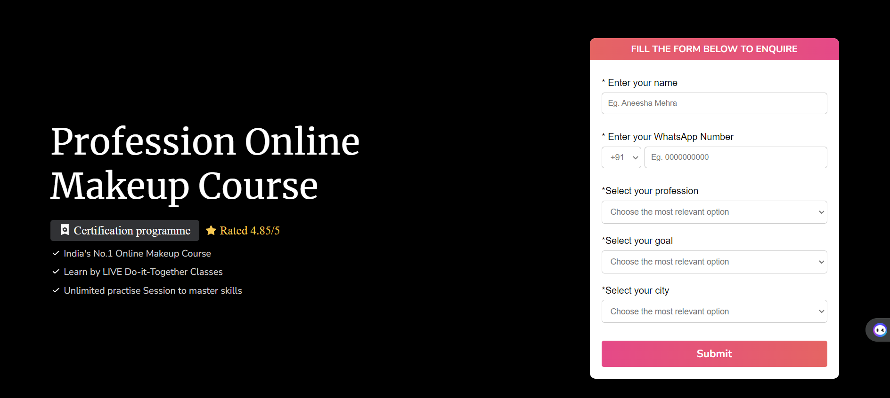

Sure, here's a `README.md` for your project:

---

# Beautician Course Ad Page

This project is a single-page advertisement for a beautician course, created as part of an assessment for AirBlack. The page highlights the key features and benefits of joining the course, including certifications and a growing community of alumni.

## Table of Contents

- [Features](#features)
- [Technologies Used](#technologies-used)
- [Installation](#installation)
- [Usage](#usage)
- [Responsiveness](#responsiveness)
- [Screenshots](#screenshots)
- [License](#license)

## Features

- **Hero Section:** Includes a header and key selling points of the course.
- **Certification Section:** Highlights the certification received upon completion.
- **Footer:** Encourages joining the community and includes social media links.

## Technologies Used

- **React**: A JavaScript library for building user interfaces.
- **CSS**: Custom styles for the page layout and design.
- **SVG and PNG**: Used for icons and images.

## Installation

To run this project locally, follow these steps:

1. **Clone the repository:**
   ```bash
   git clone https://github.com/yourusername/beautician-course-ad.git
   ```
2. **Navigate to the project directory:**
   ```bash
   cd beautician-course-ad
   ```
3. **Install dependencies:**
   ```bash
   npm install
   ```

## Usage

To start the development server and view the project in your browser:

```bash
npm start
```

The application will open in your default browser at `http://localhost:3000`.

## Responsiveness

The page is designed to be responsive and adjusts to different screen sizes. Media queries are used to change the layout and font sizes for optimal viewing on various devices.

## Screenshots


*The Form Section*


*Certificate Section*


*Footer of the Page*

## License

This project is licensed under the MIT License. See the [LICENSE](LICENSE) file for details.

---

Feel free to modify any sections or add more details as needed!
